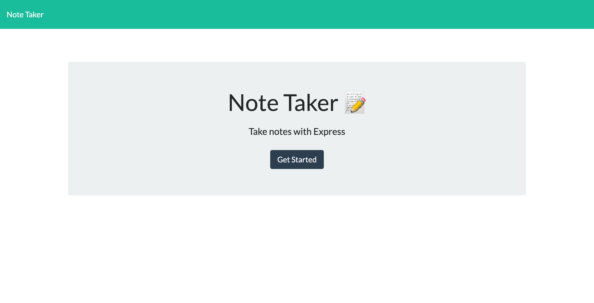
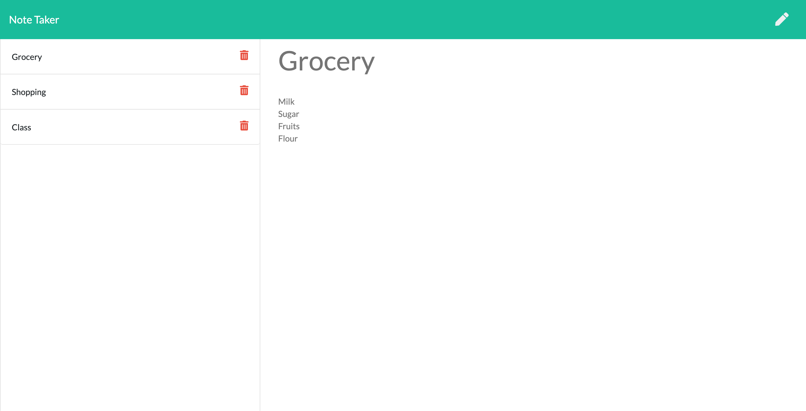

# Note Taker

## Table of Contents

- [User Story](#user-story)

- [Business Context](#business-context)

- [Acceptance Criteria](#acceptance-criteria)

- [Installation](#installation)

- [Deployed Site](#deployed-site)

- [Mock Ups](#mock-ups)

- [Questions](#questions)

## User Story

AS A user, I want to be able to write and save notes
I WANT to be able to delete notes I've written before
SO THAT I can organize my thoughts and keep track of tasks I need to complete

## Business Context

For users that need to keep track of a lot of information, it's easy to forget or be unable to recall something important. Being able to take persistent notes allows users to have written information available when needed.

## Acceptance Criteria

Application should allow users to create and save notes.
Application should allow users to view previously saved notes.
Application should allow users to delete previously saved notes.

## Installation

To install necessary dependencies, run the following command:

```
npm i
```

OR

```
npm install
```

## [Deployed Site](https://note-taker-a5.herokuapp.com/)

## Mock Ups

---




---

## Questions

If you have any questions about the repo, open issue or contact me directly at [anjalikevadiya5@gmail.com](anjalikevadiya5@gmail.com). You can find more of my work at [AnjaliKevadiya](https://github.com/AnjaliKevadiya).
